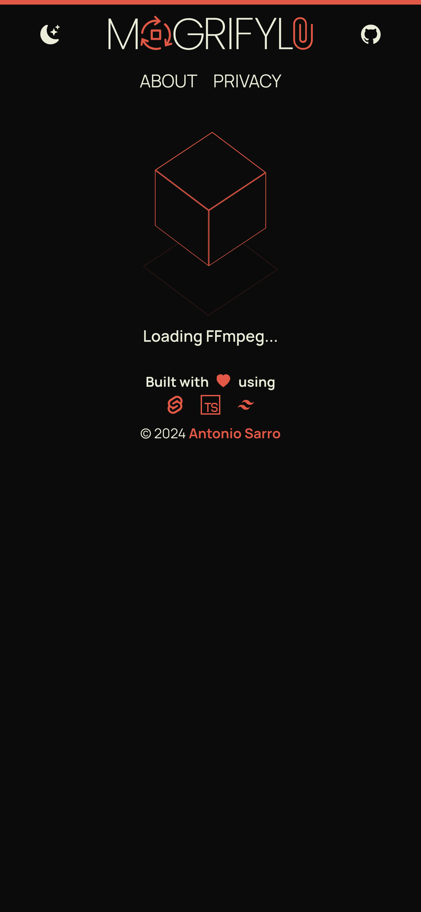
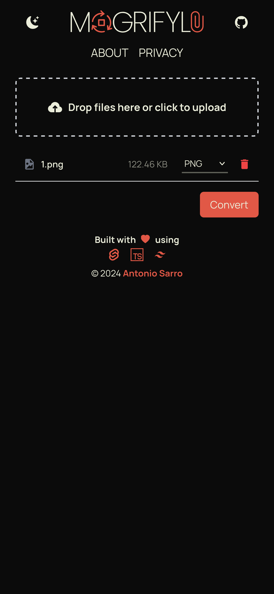

  

![views] ![stars] ![forks] ![issues] ![license] ![repo-size]

#### Introducing the Privacy-Friendly File Tool! Enjoy hassle-free file conversions with complete privacy assurance. All transformations occur securely on your device, safeguarding your data. Whether it's images or videos, your privacy is our priority. Experience seamless file manipulation with peace of mind – try it now!

<h4>
    <a href="https://github.com/antoniosarro/mogrifyle">Visit</a>
   ·  
    <a href="https://github.com/antoniosarro/mogrifyle/issues/">Report Bug</a>
   · 
    <a href="https://github.com/antoniosarro/mogrifyle/issues/">Request Feature</a>
  </h4>

 

<!-- About the Project -->

## ⭐ About the Project

<!-- Features -->

### 🎯 Features

- Effortlessly convert your media files, whether images, videos, or audio, into the most commonly used formats.

<!-- Screenshots -->

### 📷 Screenshots

 
  
  

<!-- TechStack -->

### 👾 Tech Stack

- ⚡ **[SvelteKit](https://kit.svelte.dev/)** - Empowering web apps with cybernetic enhancements
- 📦 **[TypeScript](https://www.typescriptlang.org/)** - A typed superset of JavaScript that compiles to plain JavaScript
- 🎨 **[TailwindCSS](https://tailwindcss.com/)** - A utility-first CSS framework for rapidly building custom designs
- 📝 **[ESLint](https://eslint.org/)** - The pluggable linting utility for JavaScript and JSX
- 🛠 **[Prettier](https://prettier.io/)** - An opinionated code formatter
- 🐶 **[Husky](https://typicode.github.io/husky/#/)** - Simplifying Git hooks
- 🚫 **[lint-staged](https://github.com/okonet/lint-staged)** - Run linters against staged git files
- 📄 **[commitlint](https://commitlint.js.org/#/)** - Lint commit messages
- 🎥 **[ffmpeg](https://ffmpeg.org)** - ffmpeg wasm binary to convert/edit photo, video and audio right inside browser

## 📜 License

This project is licensed under the BSD 3-Clause License - see the **[License](LICENSE)** file for details.

<!-- Code of Conduct -->

## 📝 Code of Conduct

Please read the **[Code of Conduct](https://github.com/asarro99/mogrifyle/blob/master/CODE_OF_CONDUCT.md)** if you want to contribute to this project.

## 🧑‍💻 Contributors:

**Contributions are always welcome!**

[![][contributors]][contributors-graph]

<!----------------------------------{ Labels }--------------------------------->

[views]: https://komarev.com/ghpvc/?username=asarromogrifyle&label=view%20counter&color=red&style=flat
[repo-size]: https://img.shields.io/github/repo-size/antoniosarro/mogrifyle
[issues]: https://img.shields.io/github/issues-raw/antoniosarro/mogrifyle
[license]: https://img.shields.io/github/license/antoniosarro/mogrifyle
[forks]: https://img.shields.io/github/forks/antoniosarro/mogrifyle?style=flat
[stars]: https://img.shields.io/github/stars/antoniosarro/mogrifyle
[contributors]: https://contrib.rocks/image?repo=antoniosarro/mogrifyle
[contributors-graph]: https://github.com/antoniosarro/mogrifyle/graphs/contributors
